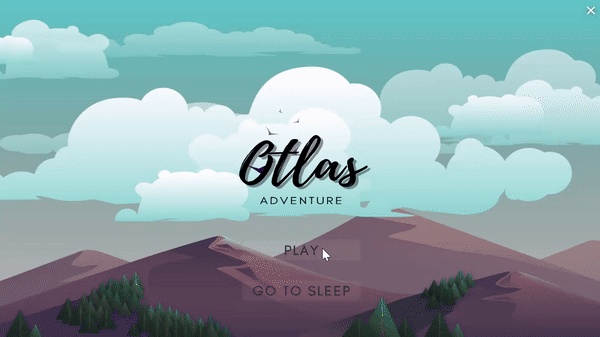

# Table of contents
- [Otlas](#otlas)
- [The story behind](#the-story-behind)
- [How to run](#how-to-run)
- [Tech stack](#tech-stack)
- [Team](#team)
- [Issues and boards](#issues-and-boards)

# Otlas

Otlas is a 2020 endless runner video game by AAA team. The player taps the screen to jump, and works towards competitive high scores.
- Calm music to help you and sheep fall asleep
- Fabulous backgrounds

### *Built with Unity*

# The story behind
The sheep wants to get some sleep very much, but she can't. Instead of counting sheep, she decided to jump over obstacles to get sleepy. The relaxing music and peaceful surroundings are from us - you have to help her get very tired next!

# How to run
### Option 1. Play online in the web, hosted by Unity
Our game is publicly available at https://play.unity.com/mg/2d/otlas-platformer

### Option 2. Play locally
You can also build and run Otlas in Unity.
For that you need version `2019.4.12f1`.
1. Download Unity here: https://unity3d.com/get-unity/download
2. Clone the repository locally via git: `git clone https://github.com/angelinag/Otlas`
3. Open Unity Hub and load the project.
4. Run the game inside Unity via the “play” button on the top center, or build it into an external executable and run by doing `Ctrl+B`

Enjoy!

### Option 3. Multi-platform support
Otlas supports basically every environment and operating system - because of our use of the Unity Engine, the game is exportable to iOS, Android, Windows Apps, WebGL, PlayStation and Xbox, making it easy to play wherever you feel comfortable!
In order to get this working you need to:
1. Follow the steps from Option 2.
2. Go to `File > Build settings`.
3. Set the settings to your platform of choice and save.
P4. ress `Ctrl+B` to build the game!

# Tech stack
Unity, Unity and Unity Platformer microgame ftw!
Instead of git we used Unity Teams Advanced, which has its own version control (Collaborate), making it much easier and faster for us to rebuild with new changes.

# Team
@aniats @Acrylami @angelinag

# License - MIT

# Issues and boards
We used **Trello** which can be seen here: https://trello.com/b/3eFWK56a/otlas
